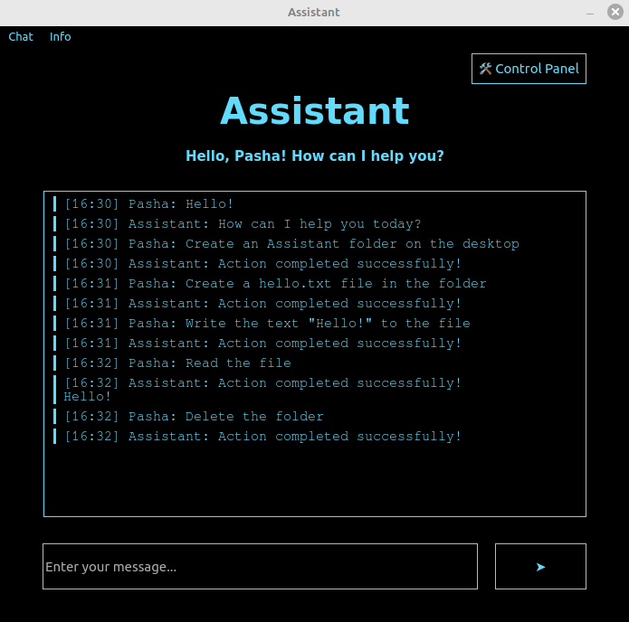

# NG_Assistant
This project is an assistant for the Linux operating system.
It can communicate, work with the file system, and also has a control panel to restrict access to certain folders.
Additionally, there's the ability to create, save, and load a chat.  
The project was developed for the C++ / Qt course from New Generation.

### Screenshot


### Requirements to run the application
1. Git >= 2.34.1
2. GCC >= 11.4.0
3. Qt >= 5.15.3
4. QMake >= 3.1
5. Make >= 4.3
6. Ollama >= 0.5.4

### How to run the application?
1. Clone the repository:

   `git clone https://github.com/shavlenkov/NG_Assistant.git`
2. Run the llama3.2 model using the Ollama utility:

   `ollama run llama3.2`
3. Navigate to the NG_Assistant folder:

   `cd NG_Assistant/`
4. Create an .env file from the .env.example file:

   `cp .env.example .env`
5. Set the URL of the Ollama server for text generation to the OLLAMA_URL variable in the .env file:

   ```
   OLLAMA_URL=
   ```
6. Build the application:

   `qmake -o build/ . && make -C build/`
7. Run the application:

   `./build/Assistant`
